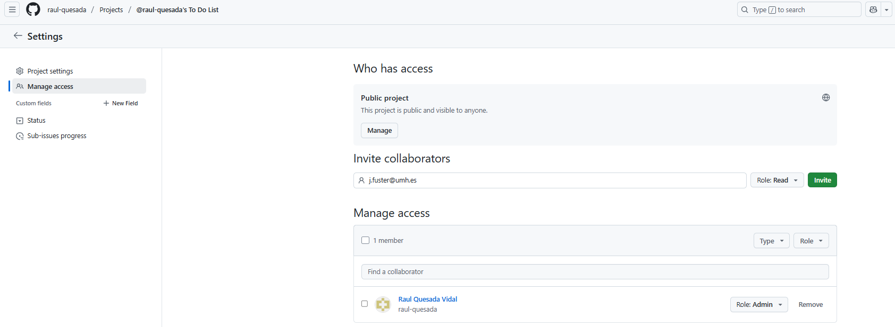

# P2 - To Do List App: Technical Documentation

## GitHub Repository URL

- [GitHub - https://github.com/raul-quesada/p2-todolist-app.git](https://github.com/raul-quesada/p2-todolist-app.git)

### Project Invitation



## Trello Board URL

- [Trello - Tablero To do List App](https://trello.com/invite/b/683d6775e310ff71fb1af75c/ATTI1952faeaac9321b45e9ba3d9c2fbe00d9D222BD8/p2-to-do-list-app)

---


## 1. Introduction

This project is a web application for task management ("To Do List") developed with Spring Boot and Thymeleaf following agile methodology. The application allows user management, registration, login, user listing, administration, and access control.

It follows a layered architecture, clearly separating:

- Presentation layer: Spring MVC controllers and Thymeleaf templates.
- Service layer: business logic and validations.
- Repository layer: database access with Spring Data JPA.

---

## 2. Implemented Features

### 2.1 Menu Bar

- Common to all pages except login and registration.
- Implemented with Bootstrap Navbar.
- Contains links to:
  - About page (ToDoList).
  - User's task page.
  - Dropdown menu with username, "Account" and "Log out" options.

### 2.2 User Listing (/registered)

- Page showing a list of registered users (ID and email).
- Includes a "Details" button to access full user description.

### 2.3 User Description (/registered/{id})

- Page displaying detailed user data: name, email, date of birth.
- Password is not displayed.

### 2.4 Admin User

- During registration, option to register as an administrator via checkbox.
- Only one administrator can exist.
- Admin user is redirected after login to the user list.

### 2.5 Page Protection

- Pages `/registered` and `/registered/{id}` are protected.
- If no active session exists, access redirects to a custom error page.

### 2.6 Blocking and Unblocking Users by Admin

- Admin can activate or deactivate users from the user list.
- Blocked users cannot log in and receive an error message.

---

## 3. New Classes and Methods (Detailed Explanation)

### **Controllers**

- **`UsuarioWebController`**  
  This controller manages all user-related web requests, including:
  - **Listing users** (`/registered`): Fetches the list of all registered users and passes it to the view for display.
  - **User details** (`/registered/{id}`): Retrieves detailed information about a specific user by ID, excluding sensitive information like passwords.
  - **Blocking/unblocking users** (`/usuarios/{id}/toggleActivo`): Allows the administrator to enable or disable user accounts via a toggle button in the UI.
  - **Session validation**: Checks for an active user session before allowing access to protected routes, redirecting unauthorized requests to an error page.

- **`ErrorController`**  
  Handles requests to the custom error page shown when unauthorized users attempt to access protected content. It returns a user-friendly page informing them they need to log in.

### **New Login Logic Enhancements**

The login submission method (`POST /login`) was enhanced with additional checks and behaviors:

- **User Active Status Check:**  
  After validating credentials, the method checks if the user’s account is active (`activo`). If the user is blocked, it adds an error message to the model ("Your account is disabled. Contact the administrator.") and returns the login form without proceeding.

- **Admin User Redirect:**  
  If the logged-in user is an administrator (`admin` flag), the method redirects them to the user listing page (`/registered`) instead of the usual tasks page. This allows admins to manage users immediately after logging in.

- **Session Handling:**  
  The method uses `ManagerUserSession` to save the logged-in user’s ID in the session for further authorization checks.

- **Error Handling:**  
  It continues handling errors for non-existent users and incorrect passwords by returning appropriate error messages on the login form.

These enhancements improve security by preventing blocked users from accessing the system and provide role-based navigation for administrators.


---

### **Services**

- **`UsuarioService`**  
  Contains business logic and data access for user operations:
  - **`existeAdmin()`**: Checks whether an administrator user already exists in the system. This is used during registration to conditionally display the "register as admin" checkbox.
  - **`toggleActivo(Long usuarioId)`**: Changes the active status (`activo`) of a user, effectively blocking or unblocking their login access. It updates the user record in the database.
  - Other existing methods include login verification, user retrieval by email or ID, and registration handling.
  - **`cambiarEstadoUsuario(Long idUsuario, boolean activo)`**: This service method updates the active status of a user, enabling or disabling their access to the application. It first retrieves the user by ID from the repository, then sets the `activo` attribute according to the provided boolean flag, and finally saves the updated user back to the database. The method is marked with `@Transactional` to ensure database consistency during the update operation.

---

### **Models**

- **`Usuario`** (Entity class)  
  Represents a user in the database, extended with new fields:
  - **`activo`** (`boolean`): Indicates whether the user is active (allowed to log in). If `false`, the user is blocked.
  - **`admin`** (`boolean`): Marks the user as an administrator, enabling access to admin-only pages and actions.
  These fields are mapped to database columns and integrated into business logic and UI decisions.

- **`UsuarioData`** (DTO)  
  This Data Transfer Object mirrors the entity fields and is used to safely transfer user data between layers without exposing sensitive information. The DTO was updated to include `activo` and `admin` properties so these attributes can be handled properly during registration, login, and user listing.

---

### **Interceptors**

- **`UsuarioInterceptor`**  
  This Spring MVC interceptor runs before controller methods and:
  - Retrieves the logged-in user’s ID from the HTTP session.
  - Loads the full user data using `UsuarioService`.
  - Attaches the user object as a request attribute (`usuario`) so views and controllers can access current user details without redundant database queries.
  This interceptor centralizes session-based user loading to ensure consistent user context throughout the web requests.

---

### **Exceptions**

- **`UsuarioNoLogeadoException`**  
  A custom unchecked exception thrown when an unauthenticated or unauthorized user tries to access a protected resource. It triggers a HTTP 401 Unauthorized response, which the application uses to display a specific error page prompting users to log in.

---

This detailed description explains how each new class and method contributes to the overall architecture and functionality of the application. It highlights the responsibilities and interactions within layers, enabling any developer on the team to understand the implementation decisions and extend the system confidently.


## 4. Thymeleaf Templates Added/Modified

- `fragments.html`: dynamic navbar based on session state.
- `listaUsuarios.html`: table with user list and buttons for details and blocking.
- `descripcionUsuario.html`: user detailed description.
- `formRegistro.html`: includes checkbox for admin registration.
- `errorAcceso.html`: custom access denied page.
- `formLogin.html`: shows error messages (blocked user, incorrect credentials, etc.).

---

## 5. Tests Implemented

Our test suite covers both unit and integration testing using **JUnit 5** and **Spring's MockMvc**, ensuring robustness and reliability of the application's core functionalities. The tests are designed following best practices to isolate layers and verify expected behaviors under different scenarios.

### 5.1 Controller Layer Tests

- **Access Control Tests:**  
  - Verify that protected routes like `/registered` and `/registered/{id}` correctly restrict access when no user session exists, returning redirections to the custom access error page (`/errorAcceso`).  
  - Confirm that authorized users with valid sessions can access these pages and that the expected data is loaded into the model for the views.

- **User Listing and Detail Pages:**  
  - Test that the list of users is correctly retrieved and passed to the Thymeleaf templates, ensuring the presence of key attributes like user emails and IDs in the rendered HTML.  
  - Check that user details pages return the correct user data (name, email, date of birth) and handle non-existent user IDs gracefully by redirecting to the user list.

- **Login Controller Tests:**  
  - Simulate login attempts with valid credentials, ensuring correct redirection based on user role (admin vs. normal user).  
  - Validate handling of invalid credentials with appropriate error messages displayed in the login form.  
  - Specifically test rejection of login attempts by blocked users (`activo == false`), verifying that the correct error message is shown and the login page is re-rendered.

- **Admin Blocking Functionality:**  
  - Test the toggle endpoint for enabling or disabling user accounts, verifying that only admin users can perform this action and that the system redirects properly after the change.  
  - Ensure the service layer updates the user’s `activo` status accordingly.

### 5.2 Service Layer Tests

- **User Service Methods:**  
  - Unit tests for key service methods like `existeAdmin()`, which checks for the presence of an administrator user in the database.  
  - Tests for `toggleActivo(Long id, boolean activo)`, confirming the change of user active status and persistence in the repository.  
  - Verification of login status logic, including handling of non-existent users, password mismatch, and blocked users.

### 5.3 Test Utilities and Mocking

- Use of **Mockito** for mocking dependencies like `UsuarioService` and `ManagerUserSession` to isolate controller logic and simulate different user session states without relying on a real database or session context.  
- MockMvc allows full simulation of HTTP requests and responses, enabling end-to-end verification of controller methods, view rendering, model attributes, and redirects.

### 5.4 Coverage and Confidence

- Tests cover both **positive** paths (valid inputs and authorized actions) and **negative** paths (invalid credentials, unauthorized access, blocked users).  
- They ensure that:
  - Security restrictions work as expected.
  - UI feedback (error messages, redirects) is consistent and user-friendly.
  - Business logic in service methods behaves correctly.
  - The application gracefully handles edge cases and errors.

### 5.5 Example Test Snippet

```java
@Test
public void loginRechazaUsuarioBloqueado() throws Exception {
    UsuarioData usuario = new UsuarioData();
    usuario.setEmail("blocked@test.com");
    usuario.setPassword("1234");
    usuario.setActivo(false);
    usuario.setAdmin(false);
    usuario.setId(1L);

    when(usuarioService.findByEmail("blocked@test.com")).thenReturn(usuario);

    mockMvc.perform(post("/login")
            .param("eMail", "blocked@test.com")
            .param("password", "1234"))
            .andExpect(status().isOk())
            .andExpect(model().attributeExists("error"))
            .andExpect(model().attribute("error", "Your account is disabled. Please contact the administrator."));
}
```

## 6. Highlighted Code Snippet

```java
@PostMapping("/login")
public String loginSubmit(@ModelAttribute LoginData loginData, Model model, HttpSession session) {
    UsuarioService.LoginStatus loginStatus = usuarioService.login(loginData.geteMail(), loginData.getPassword());

    if (loginStatus == UsuarioService.LoginStatus.LOGIN_OK) {
        UsuarioData usuario = usuarioService.findByEmail(loginData.geteMail());

        if (!usuario.isActivo()) {
            model.addAttribute("error", "Your account is deactivated. Please contact the administrator.");
            return "formLogin";
        }

        managerUserSession.logearUsuario(usuario.getId());

        if (usuario.isAdmin()) {
            return "redirect:/registered";
        }
        return "redirect:/usuarios/" + usuario.getId() + "/tareas";
    } else if (loginStatus == UsuarioService.LoginStatus.USER_NOT_FOUND) {
        model.addAttribute("error", "User does not exist");
        return "formLogin";
    } else if (loginStatus == UsuarioService.LoginStatus.ERROR_PASSWORD) {
        model.addAttribute("error", "Incorrect password");
        return "formLogin";
    }
    return "formLogin";
}
```

### Explanation

This method handles the login logic, covering different scenarios:

- Checks if the user is active.
- If blocked, shows an error message.
- Manages session and redirects differently for admin and normal users.
- Controls error messages for non-existent user or wrong password.

